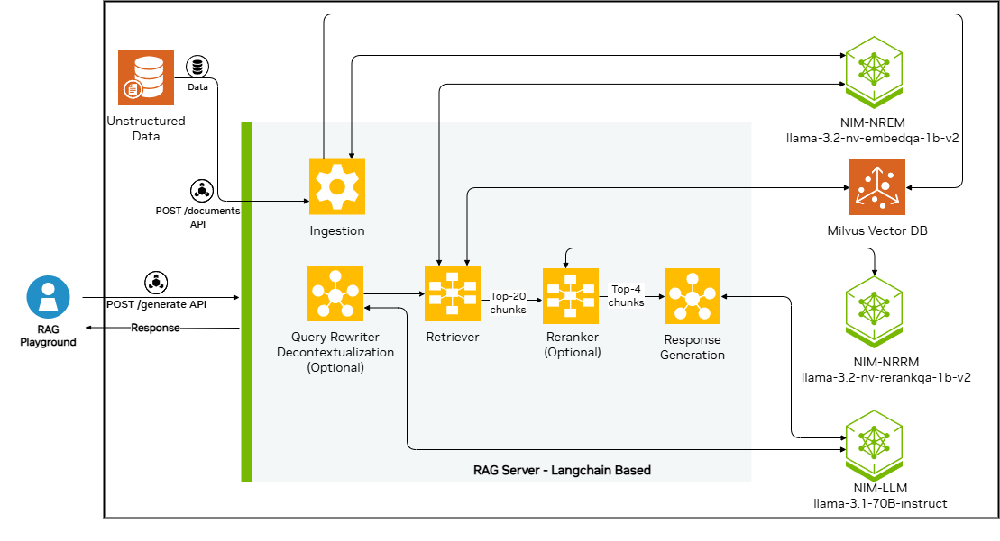

<h1>NVIDIA NIM Agent Blueprint: AI Chatbot</h1>

Use the following documentation to learn about the NVIDIA NIM Agent Blueprint: AI Chatbot.

- [Overview](#overview)
- [Target Audience](#target-audience)
- [Software Components](#software-components)
- [Technical Diagram](#technical-diagram)
- [Common Prerequisites](#common-prerequisites)
- [Hardware Requirements](#hardware-requirements)
  - [Driver versions](#driver-versions)
  - [Minimum hardware requirements for self hosting all NIMs](#minimum-hardware-requirements-for-self-hosting-all-nims)
- [Quickstart Guide](#quickstart-guide)
  - [Deploy With Docker Compose](#deploy-with-docker-compose)
  - [Deploy With Helm Chart](#deploy-with-helm-chart)
- [Data Ingestion](#data-ingestion)
- [Obtain API keys](#obtain-api-keys)
- [API Definition](#api-definition)
- [Common Customizations](#common-customizations)
  - [Changing the LLM or Embedded Model](#changing-the-llm-or-embedded-model)
  - [Customizing the Vector Database](#customizing-the-vector-database)
  - [Chunking Strategy](#chunking-strategy)
  - [Prompting Template Engineering](#prompting-template-engineering)
  - [Configuring LLM Parameters at Runtime](#configuring-llm-parameters-at-runtime)
  - [Supporting Multi-Turn Conversations](#supporting-multi-turn-conversations)
- [Troubleshooting](#troubleshooting)
- [Known issues](#known-issues)
- [Inviting the community to contribute](#inviting-the-community-to-contribute)
- [License](#license)


## Overview

This blueprint deploys a basic foundational RAG pipeline for chat Q&A using unstructured data, and serves inferencing from cloud-hosted models in [NVIDIA API Catalog](https://build.nvidia.com). You can also change this blueprint to use on-premises models for better data security and latency.


## Target Audience

This blueprint is for:

- **IT engineers**: Engineers who want a quickstart to using NVIDIA NIMs in an unstructured data based RAG solution for a virtual assistant.


## Software Components

The following are the default components included in this blueprint:

* NVIDIA NIM Microservices
   * Response Generation (Inference)
      * [NIM of meta/llama-3.1-70b-instruct](https://build.nvidia.com/meta/llama-3_1-70b-instruct)
    * Retriever Models
      * [NIM of nvidia/llama-3_2-nv-embedqa-1b-v2]( https://build.nvidia.com/nvidia/llama-3_2-nv-embedqa-1b-v2)
      * [NIM of nvidia/llama-3_2-nv-rerankqa-1b-v2](https://build.nvidia.com/nvidia/llama-3_2-nv-rerankqa-1b-v2)
* Orchestrator server - Langchain based
* Milvus Vector Database
* Text Splitter: [Recursive Character Text Splitter](https://python.langchain.com/v0.1/docs/modules/data_connection/document_transformers/recursive_text_splitter/)
* Document parsers: [Unstructured.io](https://docs.unstructured.io)
* File Types: [File types supported](https://docs.unstructured.io/platform/supported-file-types) by unstructured.io. Accuracy is best optimized for files with extension `.pdf`, `.txt` and `.md`.

We provide Docker Compose scripts that deploy the microservices on a single node.
When you are ready for a large-scale deployment,
you can use the included Helm charts to deploy the necessary microservices.
You use sample Jupyter notebooks with the JupyterLab service to interact with the code directly.

The Blueprint contains sample data from the [NVIDIA Developer Blog](https://developer.nvidia.com/blog/).
You can build on this blueprint by customizing the RAG application to your specific use case.

We also provide a sample user interface named `rag-playground`.


## Technical Diagram

  <p align="center">
  
  </p>


The image represents the architecture and workflow. The core business logic is defined in the `rag_chain_with_multiturn()` method of `chains.py` file. Here's a step-by-step explanation of the workflow from end-user perspective:

1. **User Interaction via RAG Playground**:
   - The user interacts with this blueprint by typing queries into the sample UI microservice named as **RAG Playground**. These queries are sent to the system through the `POST /generate` API exposed by the RAG server microservice. There are seperate [notebooks](./notebooks/) available which showcase API usage as well.

2. **Query Processing**:
   - The query enters the **RAG Server**, which is based on LangChain. An optional **Query Rewriter** component may refine or decontextualize the query for better retrieval results.

3. **Retrieval of Relevant Documents**:
   - The refined query is passed to the **Retriever** module. This component queries the **Milvus Vector Database microservice**, which stores embeddings of unstructured data, generated using **NeMo Retriever Embedding microservice**. The retriever module identifies the top 20 most relevant chunks of information related to the query.

4. **Reranking for Precision**:
   - The top 20 chunks are passed to the optional **NeMo Retriever Ranker microservice**. The reranker narrows down the results to the top 4 most relevant chunks, improving precision.

5. **Response Generation**:
   - The top 4 chunks are injected in the prompt and sent to the **Response Generation** module, which leverages **NeMo LLM inference Microservice** to generate a natural language response based on the retrieved information.

6. **Delivery of Response**:
   - The generated response is sent back to the **RAG Playground**, where the user can view the answer to their query as well as check the output of the retriever module using the `Show Context` option.

7. **Ingestion of Data**:
   - Separately, unstructured data is ingested into the system via the `POST /documents` API using the `Knowledge Base` tab of **Rag Playgoround microservice**. This data is preprocessed, splitted into chunks and stored in the **Milvus Vector Database** using embeddings generated by models hosted by **NeMo Retriever Embedding microservice**.

This modular design ensures efficient query processing, accurate retrieval of information, and easy customization.


## Common Prerequisites

- NVAIE developer license
- API Key - Steps [here](#obtain-api-keys)


## Hardware Requirements

Following are the hardware requirements for each component.
The reference code in the solution (glue code) is referred to as as the "pipeline".

The overall hardware requirements depend on whether you
[Deploy With Docker Compose](#deploy-with-docker-compose) or [Deploy With Helm Chart](#deploy-with-helm-chart).


### Driver versions

- GPU Driver -  530.30.02 or later
- CUDA version - 12.6 or later


### Minimum hardware requirements for self hosting all NIMs

**The NIM and hardware requirements only need to be met if you are self-hosting them.**
See [Using self-hosted NIMs](#start-the-containers-using-on-prem-models).

- 8XH100, 8XA100 or 8xL40

- **Pipeline operation**: 1x L40 GPU or similar recommended. It is needed for vectorstore milvus, if you are enabling GPU acceleration following steps [here](./deploy/compose/vectordb.yaml).
- (If locally deployed) **LLM NIM**: [Meta Llama 3.1 70B Instruct Support Matrix](https://docs.nvidia.com/nim/large-language-models/latest/support-matrix.html#llama-3-1-70b-instruct)
  - For improved paralleled performance, we recommend 8x or more H100s for LLM inference.
  - The pipeline can share the GPU with the LLM NIM, but it is recommended to have a separate GPU for the LLM NIM for optimal performance.
- (If locally deployed) **Embedding NIM**: [Llama-3.2-NV-EmbedQA-1B-v2 Support Matrix](https://docs.nvidia.com/nim/nemo-retriever/text-embedding/latest/support-matrix.html#llama-3-2-nv-embedqa-1b-v2)
  - The pipeline can share the GPU with the Embedding NIM, but it is recommended to have a separate GPU for the Embedding NIM for optimal performance.
- (If locally deployed) **Reranker NIM**: [llama-3_2-nv-rerankqa-1b-v1 Support Matrix](https://docs.nvidia.com/nim/nemo-retriever/text-reranking/latest/support-matrix.html#llama-3-2-nv-rerankqa-1b-v2)


## Quickstart Guide

   The following are the deployment options:

   * [Docker Compose](#deploy-with-docker-compose) — for a single node deployment
   * [Helm Chart](#deploy-with-helm-chart) — to deploy on a kubernetes cluster


### Deploy With Docker Compose

   #### Prerequisites <!-- omit in toc -->

   1. Verify that you meet the [common prerequisites](#common-prerequisites).

   1. Install Docker Engine. For more information, see [Ubuntu](https://docs.docker.com/engine/install/ubuntu/).

   1. Install Docker Compose. For more information, see [install the Compose plugin](https://docs.docker.com/compose/install/linux/).

      a. Ensure the Docker Compose plugin version is 2.29.1 or later.

      b. After you get the Docker Compose plugin installed, run `docker compose version` to confirm.

   1. In order to pull images required by the blueprint from NGC, you must first authenticate Docker with NGC. You can use NGC API Key obtained in the [Obtain API keys](#obtain-api-keys) section.

      ```bash
      echo "${NGC_API_KEY}" | docker login nvcr.io -u '$oauthtoken' --password-stdin
      ```

   1. (Optional) You can run some containers with GPU acceleration, such as Milvus and NVIDIA NIMS deployed on-prem. To configure Docker for GPU-accelerated containers, [install](https://docs.nvidia.com/datacenter/cloud-native/container-toolkit/latest/install-guide.html), the NVIDIA Container Toolkit, and ensure you meet [the hardware requirements](#hardware-requirements).

   1. (Optional) You can enable GPU acceleration for the Milvus vector database container, if you have at least one L40/A100/H100 GPU available. For more information, see [Configuring Milvus with GPU Acceleration](./docs/vector-database.md#configuring-milvus-with-gpu-acceleration).


  #### Start the Containers using cloud hosted models (no GPU by default) <!-- omit in toc -->

  Use the following procedure to start the containers using cloud-hosted models.

  [!IMPORTANT]
  To start the containers using on-premises models, use the procedure in the next section instead.

  1. Export your NVIDIA API key as an environment variable. Follow steps [here](#obtain-api-keys) to get an API key.

     ```bash
     export NVIDIA_API_KEY="nvapi-..."
     ```

  1. Start the containers from the repo root. This pulls the prebuilt containers from NGC and deploys it on your system.

     ```bash
     docker compose -f deploy/compose/docker-compose.yaml up -d
     ```

     *Example Output*

     ```output
      ✔ Network nvidia-rag           Created
      ✔ Container rag-playground     Started
      ✔ Container milvus-minio       Started
      ✔ Container rag-server         Started
      ✔ Container milvus-etcd        Started
      ✔ Container milvus-standalone  Started
     ```

     [!TIP]
     You can add a `--build` argument in case you have made some code changes or have any requirement of re-building containers from source code:

     ```bash
     docker compose -f deploy/compose/docker-compose.yaml up -d --build
     ```

  1. Confirm the containers are running.

     ```bash
     docker ps --format "table {{.ID}}\t{{.Names}}\t{{.Status}}"
     ```

     *Example Output*

     ```output
     CONTAINER ID   NAMES               STATUS
     39a8524829da   rag-playground      Up 2 minutes
     bfbd0193dbd2   rag-server          Up 2 minutes
     ec02ff3cc58b   milvus-standalone   Up 3 minutes
     6969cf5b4342   milvus-minio        Up 3 minutes (healthy)
     57a068d62fbb   milvus-etcd         Up 3 minutes (healthy)
     ```

  1. Open a web browser and access <http://localhost:8090> to use the RAG Playground. You can use the upload tab to ingest files into the server or follow [the notebooks](./notebooks/) to understand the API usage.


  #### Start the Containers using on-prem models <!-- omit in toc -->

  Use the following procedure to start the containers using on-premises models.

  [!IMPORTANT]
  To start the containers using cloud-hosted models, see the procedure in the previous section instead.

  1. Export NGC related environment variables to pull the containers and models. Ensure you meet the [hardware requirements](#hardware-requirements).

     ```bash
     export NGC_API_KEY="nvapi-..."
     export NVIDIA_API_KEY="nvapi-"
     ```

  1. Create a directory to cache the models and export the path to the cache as an environment variable.

     ```bash
     mkdir -p ~/.cache/model-cache
     export MODEL_DIRECTORY=~/.cache/model-cache
     ```

  1. Export the connection information for the inference and retriever services. Replace the host address of the below URLs with workstation IPs, if the NIMs are deployed in a different workstation or outside the `nvidia-rag` docker network on the same system.

     ```bash
     export APP_LLM_SERVERURL="nemollm-inference:8000"
     export APP_EMBEDDINGS_SERVERURL="embedding-ms:8000"
     export APP_RANKING_SERVERURL="ranking-ms:8000"
     ```

     [!TIP]: To change the GPUs used for NIM deployment, set the following environment variables before triggering the docker compose. You can check available GPU details on your system using `nvidia-smi`

     ```bash
     LLM_MS_GPU_ID: Update this to specify the LLM GPU IDs (e.g., 0,1,2,3).
     EMBEDDING_MS_GPU_ID: Change this to set the embedding GPU ID.
     RANKING_MS_GPU_ID: Modify this to adjust the reranking LLM GPU ID.
     RANKING_MS_GPU_ID: Modify this to adjust the reranking LLM GPU ID.
     VECTORSTORE_GPU_DEVICE_ID : Modify to adjust the Milvus vector database GPU ID. This is applicable only if GPU acceleration is enabled for milvus.
     ```

  1. Start the containers. Ensure all containers go into `up` status before testing. The NIM containers may take around 10-15 mins to start at first launch. The models are downloaded and cached in the path specified by `MODEL_DIRECTORY`.

      ```bash
      USERID=$(id -u) docker compose -f deploy/compose/docker-compose.yaml --profile local-nim up -d
      ```

     *Example Output*

     ```output
     ✔ Container milvus-minio                           Running
     ✔ Container rag-server                             Running
     ✔ Container nemo-retriever-embedding-microservice  Running
     ✔ Container milvus-etcd                            Running
     ✔ Container nemollm-inference-microservice         Running
     ✔ Container nemollm-retriever-ranking-microservice Running
     ✔ Container rag-playground                         Running
     ✔ Container milvus-standalone                      Running
     ```

  5. Open a web browser and access <http://localhost:8090> to use the RAG Playground. You can use the upload tab to ingest files into the server or follow [the notebooks](./notebooks/) to understand the API usage.


### Deploy With Helm Chart

  #### Prerequisites <!-- omit in toc -->

  - Verify that you meet the [common prerequisites](#common-prerequisites).

  - Verify that you meet the [hardware requirements](#hardware-requirements).

  - Verify that you have the NGC CLI available on your client machine. You can download the CLI from <https://ngc.nvidia.com/setup/installers/cli>.

  - Verify that you have Kubernetes installed and running Ubuntu 22.04. For more information, see [Kubernetes documentation](https://kubernetes.io/docs/setup/) and [NVIDIA Cloud Native Stack repository](https://github.com/NVIDIA/cloud-native-stack/).

  - Verify that you have a default storage class available in the cluster for PVC provisioning.
    One option is the local path provisioner by Rancher.
    Refer to the [installation](https://github.com/rancher/local-path-provisioner?tab=readme-ov-file#installation)
    section of the README in the GitHub repository.

    ```console
    kubectl apply -f https://raw.githubusercontent.com/rancher/local-path-provisioner/v0.0.26/deploy/local-path-storage.yaml
    kubectl get pods -n local-path-storage
    kubectl get storageclass
    ```

  - If the local path storage class is not set as default, it can be made default by using the following command.

    ```
    kubectl patch storageclass local-path -p '{"metadata": {"annotations":{"storageclass.kubernetes.io/is-default-class":"true"}}}'
    ```

  - Verify that you have installed the NVIDIA GPU Operator following steps [here](https://docs.nvidia.com/datacenter/cloud-native/gpu-operator/latest/getting-started.html).

  - Verify that you have a `NVIDIA_API_KEY`. Check the [Obtain API keys](#obtain-api-keys) section for steps to obtain this key.


  #### Initialize environment variables <!-- omit in toc -->

  Export your NVIDIA_API_KEY

  ```bash
  export NVIDIA_API_KEY=<>
  ```

  #### Helm deployment <!-- omit in toc -->

  Run the deploy.sh script

  ```bash
  cd deploy/helm/
  bash deploy.sh
  ```

  If the deployment is successful, all the following pods should be in a ready and running state.

  ```bash
  kubectl get pods -n foundational-rag

  NAME                                                              READY   STATUS    RESTARTS      AGE
  foundational-rag-etcd-0                                           1/1     Running   0             24m
  foundational-rag-milvus-standalone-f9cd85fb7-h7g9v                1/1     Running   1 (24m ago)   24m
  foundational-rag-minio-596fcd5b5f-6kg7p                           1/1     Running   0             24m
  foundational-rag-nim-llm-0                                        1/1     Running   0             24m
  foundational-rag-nvidia-nim-llama-32-nv-embedqa-1b-v2-6664fwfpf   1/1     Running   0             24m
  foundational-rag-text-reranking-nim-6b749ccb74-pfbkz              1/1     Running   0             24m
  rag-playground-0                                                  1/1     Running   0             24m
  rag-server-0                                                      1/1     Running   0             24m
  ```


  #### Interacting with UI service <!-- omit in toc -->

  The UI service exposes a nodePort to access the UI.

  List the services
  ```bash
  kubectl get svc -n foundational-rag
  ```

  The output of the command should list the following services.

  ```bash
  NAME                             TYPE        CLUSTER-IP       EXTERNAL-IP   PORT(S)              AGE
  foundational-rag-etcd            ClusterIP      <none>        2379/TCP,2380/TCP    25m
  foundational-rag-etcd-headless   ClusterIP      <none>        2379/TCP,2380/TCP    25m
  foundational-rag-minio           ClusterIP      <none>        9000/TCP             25m
  milvus                           ClusterIP      <none>        19530/TCP,9091/TCP   25m
  nemo-embedding-ms                ClusterIP      <none>        8000/TCP             25m
  nemo-ranking-ms                  ClusterIP      <none>        8000/TCP             25m
  nim-llm                          ClusterIP      <none>        8000/TCP             25m
  nim-llm-sts                      ClusterIP      <none>        8000/TCP             25m
  rag-playground                   NodePort       <none>        8090:32661/TCP       25m
  rag-server                       NodePort       <none>        8081:31783/TCP       25m
  ```

  Look for the UI service `rag-playground`. The port type is listed as NodePort.
  The NodePort is the one that follows the container port`8090:<nodePort>/TCP`

  In this example case, the node port is listed as`32661`, hence the UI can be accessed at http://0.0.0.0:32661/


  #### Interacting with RAG server service <!-- omit in toc -->

  List the services

  ```bash
  kubectl get svc -n foundational-rag
  ```

  Look for the RAG server service `rag-server`, the port type is listed as NodePort.
  The NodePort is the one that follows the container port`8081:<nodePort>/TCP`

  In this example case, the node port is listed as`31783`, hence the RAG server can be accessed at http://0.0.0.0:31783/docs#


  #### Using notebooks with Helm <!-- omit in toc -->

  As an alternate to the UI, you can use the notebooks [ingestion_api_usage.ipynb](../../notebooks/ingestion_api_usage.ipynb) and [retriever_api_usage.ipynb](../../notebooks/retriever_api_usage.ipynb).

  Point FOUNDATIONAL_RAG_PORT to the rag-server node port. For more information, see [Interacting with RAG server service](#interacting-with-rag-server-service).

  ```bash
  IPADDRESS = "localhost"

  # Value from rag-server service NodePort
  FOUNDATIONAL_RAG_PORT = "<NodePort>"
  # For our example case the value would be set to
  FOUNDATIONAL_RAG_PORT = "31783"
  ```


  #### Uninstalling the chart <!-- omit in toc -->

  Run the following command to uninstall the chart.

  ```bash
  helm uninstall foundational-rag -n foundational-rag
  ```


  #### Clearing the pvcs <!-- omit in toc -->

  Run the following command to clear the pvcs.

  ```bash
  kubectl delete pvc -n foundational-rag --all
  ```


## Data Ingestion

To highlight the ingestion pipeline, we will download the sample PDF files to the `data/dataset` folder, and then ingest them using the APIs.

[!IMPORTANT]
Before you can use this procedure, you must deploy the blueprint by using [Deploy With Docker Compose](#deploy-with-docker-compose) or [Deploy With Helm Chart](#deploy-with-helm-chart).


1. Download and install Git LFS by following the [installation instructions](https://git-lfs.com/).

1. Initialize Git LFS in your environment.

   ```bash
   git lfs install
   ```

1. Pull the dataset into the current repo.

   ```bash
   git-lfs pull
   ```

1. Install jupyterlab.

   ```bash
   pip install jupyterlab
   ```

1. Use this command to run Jupyter Lab so that you can execute this IPython notebook.

   ```bash
   jupyter lab --allow-root --ip=0.0.0.0 --NotebookApp.token='' --port=8889
   ```

1. Run the [ingestion_api_usage](notebooks/ingestion_api_usage.ipynb) notebook.

Follow the cells in the notebook to ingest the PDF files from the data/dataset folder into the vector store.


## Obtain API keys

To run the pipeline you need to obtain a single API key. There are two possible methods to generate an API key for accessing NIM services either for pulling the models on-prem or accessing pre-hosted models in NVIDIA API Catalog:

  - Sign in to the [NVIDIA Build](https://build.nvidia.com/explore/discover?signin=true) portal with your email.
    - Click any [model](https://build.nvidia.com/meta/llama-3_1-70b-instruct), then click **Get API Key**, and finally click **Generate Key**.
  - Sign in to the [NVIDIA NGC](https://ngc.nvidia.com/) portal with your email.
    - Select your organization from the dropdown menu after logging in. You must select an organization which has NVIDIA AI Enterprise (NVAIE) enabled.
    - Click your account in the top right, and then select **Setup**.
    - Click **Generate Personal Key**, and then click **+ Generate Personal Key** to create your API key.
      - You will use this key in the `NVIDIA_API_KEY` and `NGC_API_KEY` environment variables.


## API Definition

- [OpenAPI Specification](./docs/api_reference/openapi_schema.json)
- Notebooks demonstrating how to use the APIs can be found [here.](./notebooks/)

## Common Customizations
### [Changing the LLM or Embedded Model](./docs/change-model.md)
### [Customizing the Vector Database](./docs/vector-database.md)
### [Chunking Strategy](./docs/text-splitter.md)
### [Prompting Template Engineering](./docs/prompt-customization.md)
### [Configuring LLM Parameters at Runtime](./docs/llm-params.md)
### [Supporting Multi-Turn Conversations](./docs/multiturn.md)


## Troubleshooting

The following issues might arise when you work with this blueprint.


### Device error <!-- omit in toc -->

You might encounter an `unknown device` error during the [container build process for self-hosted NIMs](#start-the-containers-using-on-prem-models).
This error typically indicates that the container is attempting to access GPUs that are unavailable or non-existent on the host.
To resolve this issue, verify the GPU count specified in the [nims.yaml](./deploy/compose/nims.yaml) configuration file.

```bash
nvidia-container-cli: device error: {n}: unknown device: unknown
```

### Deploy.Resources.Reservations.devices error <!-- omit in toc -->

You might encounter an error resembling the following during the [container build process for self-hosted NIMs](#start-the-containers-using-on-prem-models) process.
This is likely caused by an [outdated Docker Compose version](https://github.com/docker/compose/issues/11097).
To resolve this issue, upgrade Docker Compose to version `v2.29.0` or later.

```
1 error(s) decoding:

* error decoding 'Deploy.Resources.Reservations.devices[0]': invalid string value for 'count' (the only value allowed is 'all')
```


#### Resetting the entire cache <!-- omit in toc -->

To reset the entire cache, you can run the following command.
This deletes all the volumes associated with the containers, including the cache.

```bash
docker compose down -v
```


### External Vector databases <!-- omit in toc -->

We've integrated VDB and embedding creation directly into the pipeline with caching included for expediency.
However, in a production environment, it's better to use a separately managed VDB service.

NVIDIA offers optimized models and tools like NIMs ([build.nvidia.com/explore/retrieval](https://build.nvidia.com/explore/retrieval))
and cuVS ([github.com/rapidsai/cuvs](https://github.com/rapidsai/cuvs)).


### Running out of credits <!-- omit in toc -->

If you run out of credits for the NVIDIA API Catalog,
you will need to obtain more credits to continue using the API.
Please contact your NVIDIA representative to get more credits.


### Password Issue Fix <!-- omit in toc -->

If you encounter any `password authentication failed` issues with the structured retriever container,
consider removing the volumes directory located at `deploy/compose/volumes`.
In this case, you may need to reprocess the data ingestion.


## Known issues

- The Blueprint responses can have significant latency when using [NVIDIA API Catalog cloud hosted models.](#start-the-containers-using-cloud-hosted-models-no-gpu-by-default).
- Negative confidence scores for the retrieved document chunks is seen as part of the retriever API output for a given query.
- The accuracy of the pipeline is optimized for certain file types like `.pdf`, `.txt`, `.md`. The accuracy may be poor for other file types supported by unstructured.io like `.svg`, `.ppt`, `.png`.
- In some cases ingestion of the certain file types like `.pdf` with images, `.xlsb`, `.doc`, `.gif` etc.  will require the user to manually install some packages to get it functional.


## Inviting the community to contribute

We're posting these examples on GitHub to support the NVIDIA LLM community and facilitate feedback. We invite contributions! Open a GitHub issue or pull request! See the [contributing guidelines](./CONTRIBUTING.md).


## License

This NVIDIA NIM-AGENT BLUEPRINT is licensed under the [Apache License, Version 2.0.](./LICENSE.md)
