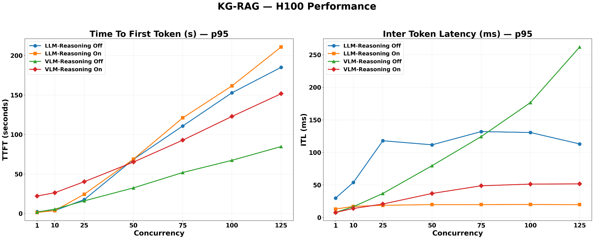
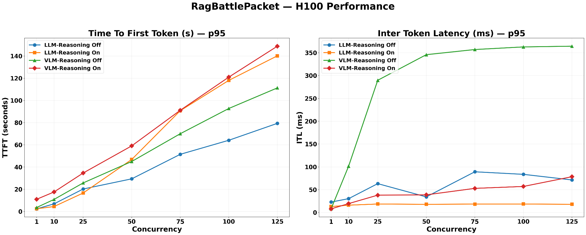
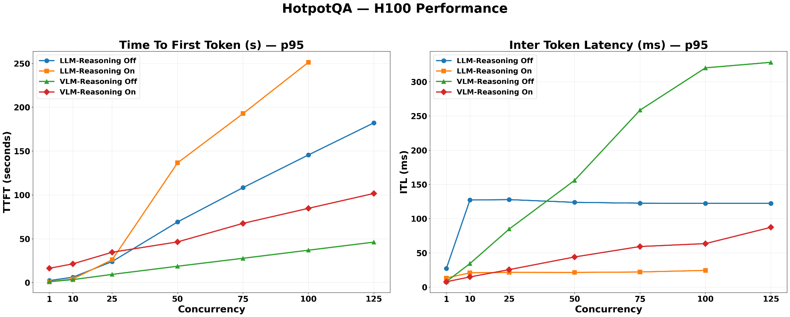
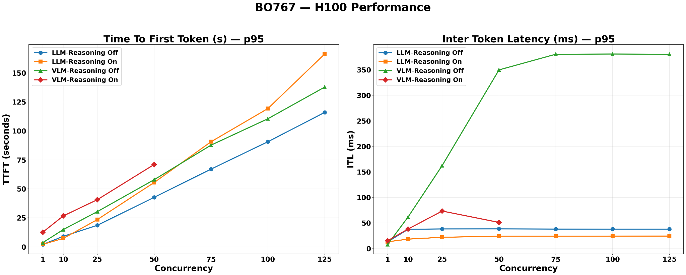
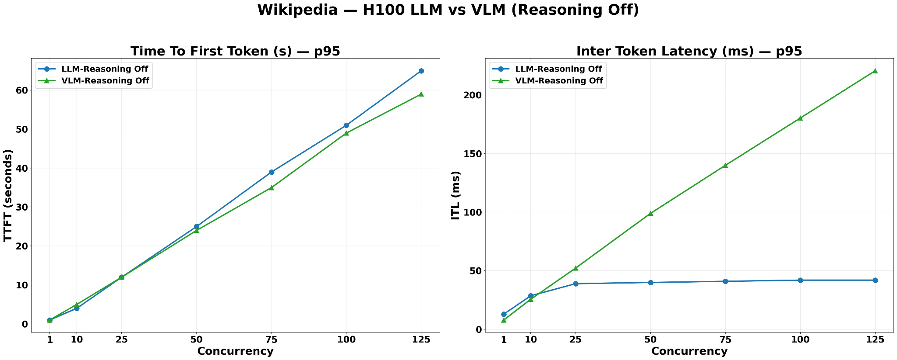
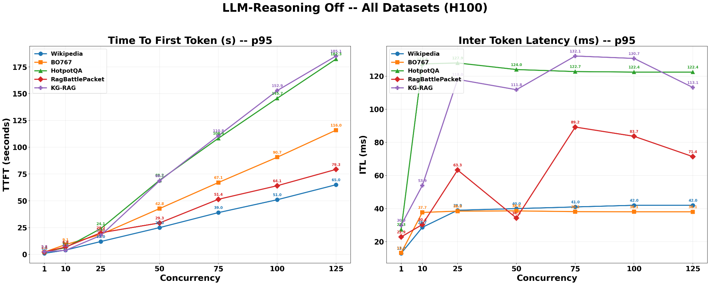

<!--
  SPDX-FileCopyrightText: Copyright (c) 2025-2026 NVIDIA CORPORATION & AFFILIATES. All rights reserved.
  SPDX-License-Identifier: Apache-2.0
-->

# RAG Performance Measurement Methodology

[GenAI Perf](https://github.com/triton-inference-server/perf_analyzer/tree/main/genai-perf), NVIDIA’s open-source benchmarking tool evaluates end-to-end RAG pipeline performance under realistic load conditions. By testing across varying levels of concurrency, it offers a consistent and reproducible way to compare different RAG deployment configurations.

## Key Terms

| Term | Description |
|------|-------------|
| **Total Requests** | The total number of questions issued to the RAG server in a single benchmark run. Controls the size of the workload and is kept constant across configurations for fair comparison. |
| **Concurrency** | The number of simultaneously active worker threads sending requests to the server. A higher concurrency simulates a heavier multi-user load. |
| **N_Times** | The number of measured benchmark iterations performed after warm-up. Multiple iterations improve statistical stability of the reported metrics. In all experiments reported in this document, `N_Times` is set to 3. |
| **Input Sequence Length (ISL)** | The number of tokens in the input prompt sent to the RAG server. |
| **Output Sequence Length (OSL)** | The number of tokens in the RAG server's generated response. |
| **TTFT (Time to First Token)** | The elapsed time from when a request is submitted until the first output token is returned. A key indicator of perceived responsiveness in streaming deployments. |
| **Inter-Token Latency (ITL)** | Defined as (E2E Latency - TTFT) / (OSL - 1), where OSL is the number of output tokens generated per request, averaged across all requests in the benchmark run. |
| **KV Cache** | A memory buffer on the GPU (HBM) storing the key-value attention states computed for all tokens in an active request. KV cache size grows with sequence length, number of model layers, and hidden dimension. When aggregate KV cache across concurrent requests saturates HBM, new requests queue rather than execute, driving up TTFT. |
| **HBM (High Bandwidth Memory)** | The GPU's on-chip memory (e.g., 80 GB on H100). |
| **Prefill** | The stage in which the model processes the full input prompt simultaneously to construct the KV cache. |
| **Decode** | The autoregressive phase where output tokens are generated one at a time. |
| **Batch / Effective Batch Size** | The set of requests processed simultaneously in a single GPU forward pass during the decode phase. At each decode step, the GPU computes attention over the accumulated KV caches of all requests in the active batch and generates one new token per request. A larger batch means more requests share the same forward pass, increasing per-token contention for GPU memory bandwidth and raising ITL. The effective batch size at any moment is constrained by available HBM: once the aggregate KV cache of active requests saturates HBM, additional requests queue rather than enter the batch. Configurations with a smaller per-request KV cache footprint (smaller model, shorter context) sustain a larger effective batch size under the same HBM budget. |
| **Reasoning Chain / Chain-of-Thought** | An extended internal monologue generated by the model before producing its final answer, used to decompose complex questions into intermediate reasoning steps. For Llama-3.3-Nemotron-Super-49B, reasoning is activated by setting the system prompt to "detailed thinking on" and suppressed by "detailed thinking off" — no model weight change occurs between modes. When active, reasoning tokens are generated autoregressively in the same decode phase as the final answer and occupy KV cache slots for the full duration of the request, increasing TTFT and ITL relative to reasoning-off. |

## Benchmarking Modes

The benchmark supports two distinct modes depending on the evaluation objective.

### Mode 1 — Synthetic Sequence-Length Benchmarking

In this mode, the benchmarking workload is defined by a target input sequence length and a target output sequence length rather than by real questions. Synthetic queries are programmatically generated to match the specified token lengths, enabling precise control over the load profile and allowing users to isolate the performance impact of sequence length independently of question content. To support retrieval in this mode, a Wikipedia dataset of 50,000 records is pre-ingested into the Vector Database, providing a sufficiently large and diverse document corpus for the retrieval stage to operate under realistic conditions.

### Mode 2 — Dataset-Driven Benchmarking

A curated set of domain-specific questions serves as the request pool. To prevent unbounded generation from obscuring true system throughput, the maximum output token length is capped at 32,000 tokens, ensuring responses remain within a well-defined generation budget and that results are directly comparable across runs.

| Dataset | Number of Questions | Source Documents | Size | QA Characteristics |
|---------|--------------------:|------------------|------|-------------------|
| [RagBattlePacket](https://www.eyelevel.ai/post/most-accurate-rag) | 92 | Deloitte public tax PDFs | 1,146 pages | 92 questions across text, tabular, and graphical categories; visually dense corpus with rich tables and figures requiring cross-modal understanding |
| [KG-RAG](https://github.com/docugami/KG-RAG-datasets/tree/main/sec-10-q/data/v1) | 195 | SEC 10-Q PDFs + KG triples | 1,037 pages | Entity-centric factual QA over structured financial filings; questions target specific named entities and numerical facts with minimal visual content |
| [HotPotQA](https://huggingface.co/datasets/hotpotqa/hotpot_qa) | 979 | Wikipedia paragraphs | ~113K QA pairs; 2,673 source documents | Multi-hop reasoning requiring the model to chain facts across multiple documents (bridge and comparison); plain text only with no tables or figures |
| [BO767](https://digitalcorpora.org/) | 487 | 767 PDFs | 54,730 pages | Varied, heterogeneous content across a large-scale mixed corpus of forensic and operational documents; high proportion of image and structured content alongside text |

## How It Works
The following sections describe how benchmarking works.
### Request Pool Construction

Depending on the selected mode, the request pool is constructed differently:

- **Synthetic mode:** Synthetic prompts are generated with ISL and OSL set to 128.
- **Dataset mode:** Questions are drawn sequentially from the curated benchmark dataset in a round-robin fashion. Once all questions in the dataset have been issued, the cycle restarts from the beginning, continuing until the total number of requests defined by `total_requests` is reached. This ensures uniform dataset coverage regardless of the configured workload size.

In both modes, the `total_requests` parameter guarantees that every configuration is evaluated against an identical, fixed-size workload, enabling fair and reproducible comparisons across deployment variants.

### Concurrency Sweep

GenAI Perf spawns *N* worker threads, where *N* is driven by a concurrency parameter. The blueprint sweeps across the following concurrency levels: **1, 10, 25, 50, 75, 100, 125** — allowing users to observe how the system scales and identify the point at which latency or throughput begins to degrade.

### Sequential Request Dispatch

Each thread draws questions from the pool one at a time in sequence, taking the next request only after a response to the current one has been received. This models realistic per-user session behavior and avoids artificially inflating throughput through intra-thread batching.

### Warm-Up and Measured Runs

Before recording any metrics, GenAI Perf executes an initial warm-up run to bring the RAG servers to a steady operational state, eliminating cold-start artifacts. The benchmark is then repeated for a configurable number of iterations (`N_Times`), ensuring that the collected statistics are stable and reproducible.

### Performance Result Collection

For every request across all threads and iterations, GenAI Perf records timing and outcome data. These are aggregated into a performance result store, from which key metrics — including Time-to-First-Token and Inter-Token Latency — are computed and reported per concurrency level.

## Configuration and Performance Results
The following sections provide further information about configuration and performance results.
### Configuration and Setup

The following deployment configurations are evaluated:

- **LLM-49B** — [Llama-3.3-Nemotron-Super-49B](https://build.nvidia.com/nvidia/llama-3_3-nemotron-super-49b-v1_5/modelcard): A key feature is the reasoning toggle — setting the system prompt to "detailed thinking on" causes the model to generate an internal chain-of-thought before the final answer; "detailed thinking off" produces a direct response. This is a system-prompt switch — no weight change occurs between modes.
- **VLM nano** — [Nemotron Nano VL](https://build.nvidia.com/nvidia/nemotron-nano-12b-v2-vl/modelcard): Its smaller parameter count means significantly lower KV cache memory consumption per request compared to the 49B model.
- **Ingestion setup:**
  - *Default ingestion:* The default ingestion that RAG 2.4.0 uses.
  - *Default ingestion with VLM image captioning enabled:* Details in [Image Captioning Support](image_captioning.md). VLM is enabled during ingestion to extract image and structured content from documents, and also enabled at query time to process retrieved image and structured chunks via the multimodal pipeline.

| # | LLM Model | Embedding Model | Reasoning On/Off | Ingestion Method |
|---|-----------|----------------|-------------------|-----------------|
| 1 | LLM-49B | Default Embedding | On | Default Ingestion |
| 2 | LLM-49B | Default Embedding | Off | Default Ingestion |
| 3 | VLM nano | Default Embedding | On | Default Ingestion with VLM image captioning enabled |
| 4 | VLM nano | Default Embedding | Off | Default Ingestion with VLM image captioning enabled |

### Impact Factors

TTFT (Time to First Token) at high concurrency is primarily determined by KV cache memory pressure. Each active request occupies HBM proportional to sequence length × model layers × hidden dimension. When aggregate KV cache across concurrent requests saturates HBM, incoming requests queue, driving up p95 TTFT.

Factors governing TTFT:

- **Model size:** A larger model (49B) has more layers and a wider hidden dimension, consuming more HBM per request than a smaller model (12B) at the same input length.
- **Reasoning chain:** When reasoning is enabled, the model generates a full chain-of-thought before the first answer token. The caller's perceived TTFT includes the full thinking chain duration, and the extended request lifetime occupies KV cache slots for longer, accelerating HBM saturation under concurrency.
- **Image processing pipeline (VLM configurations only):** When VLM inference is enabled and retrieved documents contain chunks with `content_metadata.type = "image"` or `"structured"`, the pipeline fetches thumbnail images from MinIO object storage, encodes them to base64 PNG, and injects them into the prompt alongside text before generation begins. This pre-generation overhead adds directly to TTFT per request, independent of KV cache pressure.

**ITL (Inter-Token Latency) measures batch contention during the decode phase.** At each decode step, the GPU computes attention over all active requests' accumulated KV caches simultaneously. The more concurrent requests sharing a decode step, the longer each individual token waits — resulting in higher ITL.

Factors governing ITL:

- **Effective batch size:** Configurations that fit more concurrent requests into HBM simultaneously (small model + short outputs) produce higher ITL due to greater per-token contention.
- **Output length per request:** Longer outputs per request (reasoning chains) reduce how many requests can coexist in HBM at once, lowering batch contention and ITL.

### Dataset Mode Results

The purpose of this mode is to evaluate the performance of RAG under different usage of LLM and VLM, along with enabling reasoning on or off. The following Helm chart configuration is applied for retrieval:

| # | Configuration | Description | Value |
|---|--------------|-------------|-------|
| 1 | LLM/VLM #GPUs | Number of GPUs allocated to LLM/VLM | 2 |
| 2 | Reranker / Embedding / VectorDB #GPU | Number of GPUs allocated to each service | 1 |
| 3 | Citation | Whether citation source should be returned | Off |
| 4 | VDB K | Number of records taken from Vector DB | 100 |
| 5 | Reranker K | Top number of records returned after reranking | 10 |
| 6 | total_requests | Total requests sent to RAG server per concurrency | MAX(100, 5 × Concurrency) |

#### KG-RAG

- TTFT is highest (~210s p95) for the LLM-Reasoning-On configuration due to the large per-request KV cache of the 49B model and extended request lifetimes from reasoning-chain generation.
- TTFT is lowest for VLM-Reasoning-Off, consistent with the VLM nano model's smaller KV cache on a text-dominant structured corpus.
- Both LLM-Reasoning-Off and VLM-Reasoning-On configurations show intermediate TTFT values.
- ITL is highest for VLM-Reasoning-Off (~260ms) because the small VLM nano KV cache allows for a high number of concurrent requests, maximizing batch contention during each decode step.
- VLM-Reasoning-On records significantly lower ITL than VLM-Reasoning-Off — approximately 20% of the reasoning-off value — despite using the same 12B model. When reasoning is enabled, the extended chain-of-thought output occupies KV cache slots for a much longer duration per request, substantially reducing the number of requests the scheduler can hold in the active batch simultaneously. This ITL reduction is proportionally similar to the LLM-Reasoning-On vs. LLM-Reasoning-Off drop, but far larger in absolute milliseconds — because VLM-Reasoning-Off reaches ~260ms due to its large active batch, so shrinking that batch via reasoning has much more room to reduce contention than on the LLM side, where the batch was already small.
- ITL is lowest for LLM-Reasoning-On (< 20ms, near-flat). The 49B model with its long reasoning-chain outputs effectively reduces the concurrent batch size, thereby limiting per-token contention.
- ITL for LLM-Reasoning-Off is intermediate (above LLM-Reasoning-On). This is because the same large 49B model with short outputs permits more requests to share decode steps, leading to increased contention relative to the reasoning-on case.

#### RagBattlePacket

- VLM-Reasoning-On and LLM-Reasoning-On converge at the highest TTFT values, both exceeding 140s at concurrency=125.
- For VLM configurations on RagBattlePacket, VLM-enabled ingestion produces chunks with `content_metadata.type = "image"` and `"structured"` in addition to plain text. At query time, the pipeline fetches thumbnails from MinIO and constructs a multimodal prompt (text + images) sent to VLM nano. This image processing overhead — MinIO fetch, base64 PNG encoding, and a larger multimodal prefill — adds directly to TTFT per request.
- LLM-Reasoning-Off records substantially lower TTFT than both VLM configurations. Default ingestion produces text-only chunks and `enable_vlm_inference=False` means no image processing pipeline is triggered — generation begins immediately on a text-only prompt.
- LLM-Reasoning-On records the lowest ITL, remaining near-flat below 20ms throughout.
- VLM-Reasoning-Off records the highest ITL, plateauing near 360ms from concurrency=25 onwards — the steepest plateau observed across all datasets.
- The rapid ITL rise at low concurrency (concurrency=10 to 25) followed by a plateau indicates the system reaches maximum batch occupancy early, after which the scheduler begins queuing rather than further expanding the active batch.
- VLM-Reasoning-On records approximately 6× lower ITL than VLM-Reasoning-Off on this dataset. Both VLM modes go through the same image processing pipeline, so the delta is driven entirely by output length. VLM-Reasoning-Off produces short outputs — the 12B model's small KV cache already allows a large active batch, and short per-request lifetimes keep that batch continuously full, sustaining high decode contention. When reasoning is enabled, each request generates a long chain-of-thought over the visually complex tax documents before producing its final answer, holding each request in the active batch for a far longer duration, preventing the scheduler from admitting new requests and shrinking the effective batch size significantly. The magnitude of the drop is amplified by RagBattlePacket's document complexity, which elicits longer reasoning chains than simpler text corpora.

#### HotPotQA

- LLM-Reasoning-On produces the highest p95 TTFT of all datasets, exceeding 250s at concurrency=125.
  - *Reason:* HotPotQA's multi-hop questions require chaining facts across multiple source documents, which elicits longer reasoning chains from a thinking-enabled model. Each request holds a large KV cache slot (49B model) for an extended duration, accelerating HBM saturation at scale.
- VLM-Reasoning-Off records the lowest TTFT.
  - *Reason:* HotPotQA source documents are plain Wikipedia text containing no tables or figures, so VLM ingestion does not inflate retrieved context. The model-size advantage of VLM nano translates directly into lower KV cache pressure and reduced queuing latency.
- VLM-Reasoning-Off again records the highest ITL, rising continuously to approximately 330ms at concurrency=125. This indicates the system has not yet reached batch saturation at concurrency=125 on this dataset, consistent with HotPotQA's short Wikipedia paragraph chunks producing compact retrieved contexts that allow the VLM nano model to continue accepting additional concurrent requests at the highest tested concurrency.
- LLM-Reasoning-On remains the lowest ITL configuration, near-flat below 25ms.

#### BO767

- On BO767, LLM-Reasoning-Off achieves lower TTFT than VLM-Reasoning-Off, even though LLM-49B is the larger model. This reversal is driven by the additional image processing pipeline overhead (thumbnail fetch and encoding) that only VLM configurations incur on this visually dense corpus.
- LLM-Reasoning-On records the highest TTFT, reaching approximately 165s at concurrency=125, driven by the 49B model's large per-request KV cache and extended request lifetimes from reasoning-chain generation.
- VLM configurations carry additional per-request TTFT overhead from the image processing pipeline. The BO767 VLM-ingested index contains 45,819 image chunks and 31,030 structured chunks (49.2% of total records). When these chunk types appear in the retrieved top-10, the pipeline fetches thumbnails from MinIO, encodes them to base64 PNG, and sends a multimodal prompt to VLM nano — adding latency before generation begins on every affected request.
- LLM configurations are immune to this overhead regardless of index content. With `enable_vlm_inference=False`, the query-time pipeline performs text-only generation with no MinIO fetch, explaining why LLM-Reasoning-Off achieves lower TTFT than VLM-Reasoning-Off despite being the larger model.
- VLM-Reasoning-Off ITL plateaus at approximately 380ms by concurrency=50, followed by a sustained plateau through concurrency=125 — indicating the system reaches maximum batch occupancy early on this corpus.
- LLM-Reasoning-Off plateaus at approximately 40ms, well below VLM-Reasoning-Off, consistent with the 49B model's larger per-request KV cache limiting the concurrent batch size.
- LLM-Reasoning-On records the lowest ITL, near-flat below 25ms across all concurrency levels.

### Cross-Dataset Patterns

**TTFT Ordering (Time to First Token)** — Across all four datasets, the following TTFT ordering holds consistently:

- LLM-Reasoning-On produces the highest or joint-highest TTFT, driven by the combination of a large per-request KV cache and long request lifetimes from reasoning-chain generation.
- VLM-Reasoning-Off produces the lowest or joint-lowest TTFT, benefiting from the VLM nano model's small KV cache footprint and the absence of reasoning-chain latency.
- The relative ordering of LLM-Reasoning-Off vs. VLM-Reasoning-Off depends on corpus visual content. On visually dense corpora (RagBattlePacket, BO767), VLM-enabled ingestion produces image and structured chunks that trigger per-request image processing overhead at query time (MinIO thumbnail fetch, base64 encoding, multimodal prompt construction), adding directly to TTFT for VLM configurations. LLM configurations bypass this pipeline entirely, achieving lower TTFT despite the larger model. On text-dominant corpora (HotPotQA, KG-RAG), no image processing is triggered and the 12B model's smaller KV cache footprint gives VLM-Reasoning-Off the lower TTFT.

**ITL Ordering (Inter-Token Latency)** — Across all datasets, the ITL ordering is fully consistent:

| Rank | Configuration | Mechanism |
|------|--------------|-----------|
| **Highest ITL** | VLM-Reasoning-Off | Small 12B model + short outputs = maximum concurrent requests in HBM = highest batch contention per decode step. |
| **2nd** | LLM-Reasoning-Off | Large 49B model limits concurrency, but short outputs allow moderate batch occupancy. |
| **3rd** | VLM-Reasoning-On | Reasoning chain extends output length, reducing concurrent requests in HBM vs. reasoning-off. |
| **Lowest ITL** | LLM-Reasoning-On | Large 49B model + very long reasoning-chain outputs = minimum concurrent requests in HBM = lowest batch contention. |

**ITL Plateau Behavior** — VLM-Reasoning-Off ITL plateaus or slightly declines at very high concurrency on several datasets (RagBattlePacket from c=25, BO767 from c=50). This reflects the onset of request queuing: once HBM is saturated, the scheduler queues incoming requests rather than expanding the active decode batch, which caps batch contention and prevents further ITL growth.

### Synthetic Mode Results

The purpose of this mode is to re-evaluate the latency difference between LLM and VLM in isolation, removing dataset-specific effects such as visual content and reasoning-chain variability. A Wikipedia dataset of 50,000 records is pre-ingested into the Vector Database, providing a sufficiently large and diverse text-only corpus for the retrieval stage to operate under realistic conditions. The same Helm chart configuration as dataset mode is applied. The workload is fixed at ISL=128, OSL=128, representing an ordinary conversational use case — short questions, short answers — where each request occupies minimal KV cache.

The same hardware allocation as dataset mode is applied: 2 GPUs for the LLM/VLM model server and 1 GPU each for the reranker, embedding model, and vector database.

With reasoning disabled on both configurations and a uniform text-only corpus, the results expose the pure effect of model size on each metric:

- **TTFT:** LLM-Reasoning-Off records marginally higher TTFT than VLM-Reasoning-Off across all concurrency levels, reaching approximately 65s vs. 60s at concurrency=125. Both curves rise linearly throughout the tested range, consistent with a chat-style workload where each request places minimal KV cache pressure. This confirms that for conversational workloads, both LLM and VLM configurations sustain responsive TTFT without entering a queuing collapse, and the model-size difference has negligible practical impact on user-perceived latency in this regime. The narrow gap between the two configurations reflects the fact that at these short sequence lengths, both models receive equally small inputs and produce equally short outputs — the KV cache size per request is nearly identical, leaving model parameter count as the only differentiator with a proportionally small impact.

- **ITL:** The two configurations diverge sharply. LLM-Reasoning-Off ITL plateaus and remains flat at approximately 40ms from concurrency=25 onwards, indicating the decode batch has reached its HBM capacity and the scheduler has begun queuing excess requests beyond that point. VLM-Reasoning-Off ITL rises steeply and continuously, reaching approximately 220ms at concurrency=125 with no plateau visible — the 12B model's small per-request KV cache allows the scheduler to keep admitting more concurrent requests into the active decode batch as concurrency grows, continuously increasing per-token contention. The 49B LLM model's larger KV cache footprint caps the effective batch size early, preventing further ITL growth beyond concurrency=25.

Taken together, the two metrics reveal two distinct saturation thresholds: decode batch saturation, which the LLM hits at low concurrency and is reflected in the ITL plateau, and full system TTFT saturation, which neither configuration reaches within the tested concurrency range for this chat-scale workload. This synthetic result serves as a clean baseline confirmation of the theoretical framework — on a text-only corpus with no image processing overhead, model size is the sole differentiating factor, producing the expected TTFT ordering (LLM slightly higher) and ITL ordering (VLM significantly higher at scale).

### Cross-Dataset Latency with LLM-Reasoning-Off

In addition to per-dataset views, all four benchmarks plus the synthetic Wikipedia workload are aggregated into a single comparison using the same Llama-3.3-Nemotron-Super-49B configuration with reasoning disabled. This chart reports p95 Time To First Token (TTFT) and Inter-Token Latency (ITL) as concurrency increases on a single H100.

Wikipedia synthetic serves as a lower bound: with fixed ISL=128 and OSL=128, no retrieval, and text-only inputs, it represents the lightest possible workload for the model. All real RAG datasets sit above this baseline. HotPotQA and KG-RAG show the highest TTFT and ITL, reflecting their heavier retrieved contexts (multi-hop Wikipedia reasoning and SEC 10-Q filings). RagBattlePacket falls in the middle, while BO767 exhibits the lowest ITL among the RAG datasets and closely tracks the Wikipedia ITL plateau. Its TTFT remains higher than Wikipedia's because real retrieval still adds pre-generation overhead.

Taken together, this cross-dataset view confirms that the latency behavior of the 49B LLM is consistent and predictable: for a fixed model and hardware configuration, TTFT increases roughly linearly with concurrency for every dataset, and datasets that supply more complex or extensive retrieved context exhibit proportionally higher TTFT and ITL than the synthetic baseline.

## Key Takeaways

**Model size governs the TTFT/ITL trade-off direction, but corpus visual content determines its magnitude.** On text-only corpora, the smaller VLM nano (12B) delivers lower TTFT than the larger LLM-49B due to its reduced KV cache footprint — but this advantage is fully reversed on visually dense corpora (BO767, RagBattlePacket), where the VLM image processing pipeline (MinIO thumbnail fetch, base64 encoding, multimodal prompt construction) adds per-request overhead that outweighs the model-size benefit. As a result, on visually dense corpora, LLM-Reasoning-Off achieves lower TTFT than VLM-Reasoning-Off despite being the larger model — the image processing overhead is the dominant factor, not model size.

**Reasoning is a force multiplier on TTFT, not just an accuracy switch.** Enabling reasoning on LLM-49B produces the highest TTFT in nearly every dataset tested. The chain-of-thought is generated autoregressively before the first answer token is returned, extending request lifetime and occupying KV cache slots for longer — accelerating HBM saturation under concurrency. This is a system-level cost, not just a per-request latency cost.

**TTFT and ITL pull in opposite directions by design.** A small model with short outputs lets the scheduler pack more requests in parallel — this keeps TTFT low but creates a large, contended decode batch that drives ITL up. A large model with long reasoning outputs does the opposite: it shrinks the active batch, keeping ITL low but consuming more HBM per request and causing queuing that raises TTFT. Across every dataset tested, the lowest-TTFT configuration always has the highest ITL, and vice versa. No single configuration optimizes both metrics simultaneously — configuration selection is a deliberate trade-off between response latency and decode throughput.

**ITL plateau is the earliest signal of HBM saturation.** Before TTFT shows non-linear growth, ITL flattening reveals that the scheduler has already begun queuing requests and capping the decode batch. In the synthetic experiment, LLM ITL plateaus at concurrency=25 while TTFT is still rising linearly, consistent with a chat-scale workload (ISL=128, OSL=128) where each request is small and queuing remains well controlled. In this regime, both LLM and VLM configurations keep end-user response times within an acceptable band.

## Related Topics

- [RAG Accuracy Benchmarks](accuracy-benchmarks.md)
- [Evaluate Your NVIDIA RAG Blueprint System](evaluate.md)
- [Enable Reasoning in Nemotron LLM Models](enable-nemotron-thinking.md)
- [VLM-Based Inferencing in RAG](vlm.md)
- [Image Captioning Support](image_captioning.md)
- [Best Practices for Common Settings](accuracy_perf.md)
