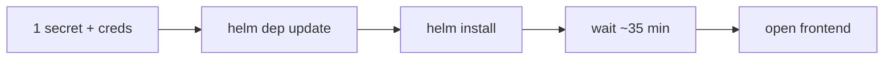

# NVIDIA RAG Blueprint x Oracle 26ai — One-Page Quickstart

This is the **single happy path** any new operator can follow top-to-bottom in one terminal. For deeper detail, see [README.md](./README.md).

No custom images needed — uses stock NGC images with Oracle deps installed at pod startup.



## Prereqs (one-time)

| Need | How |
|---|---|
| OKE cluster with GPU nodes (≥1× H100/A100/L40, compute capability ≥ 7.5) | OCI Console → Container Engine for Kubernetes |
| `kubectl` pointed at it | `oci ce cluster create-kubeconfig --cluster-id <ocid>` |
| `helm` ≥ 3.14 | `brew install helm` (macOS) / package manager |
| OCI CLI configured | `oci setup config` |
| NGC API key | <https://ngc.nvidia.com> → Setup → API Key |
| Oracle Container Registry (OCR) auth token | <https://container-registry.oracle.com> → Profile → Auth Token. Also: open *Database → Private AI* and **accept the license** (mandatory even with a token). |

## Step 1: One Kubernetes Secret for OCI

```bash
kubectl create secret generic oci-config \
  --from-file=config=$HOME/.oci/config \
  --from-file=oci_api_key.pem=$HOME/.oci/oci_api_key.pem
```

## Step 2: Export creds

```bash
export NGC_API_KEY=<your NGC key>
export ORACLE_SSO_EMAIL=<your Oracle SSO email>
export ORACLE_OCR_TOKEN=<your OCR auth token>
```

## Step 3: Fetch the chart dependencies

The wrapper Chart depends on `gpu-operator`, `k8s-nim-operator`, and the
`nvidia-blueprint-rag` sub-chart. We do **not** bundle these tarballs in
the repo (per upstream review). Pull them from the listed registries:

```bash
# Materialise the upstream RAG chart's own deps first (it is referenced
# via `file://` from the wrapper chart, and helm dep update is not
# recursive).
helm dependency update deploy/helm/nvidia-blueprint-rag

# Then materialise the wrapper chart's deps.
helm dependency update examples/oracle/helm
```

Both produce `*.tgz` files inside each chart's local `charts/` directory.
These are git-ignored so the bundled artefacts never re-enter the repo.

## Step 4: Install (creates a fresh ADB)

```bash
helm install rag examples/oracle/helm \
  -f examples/oracle/helm/values.create-adb.yaml \
  --set imagePullSecret.password=$NGC_API_KEY \
  --set ngcApiSecret.password=$NGC_API_KEY \
  --set oracle.containerRegistry.username=$ORACLE_SSO_EMAIL \
  --set oracle.containerRegistry.password=$ORACLE_OCR_TOKEN \
  --timeout 60m
```

If your OKE cluster already has `gpu-operator` and `k8s-nim-operator` installed, add:

```bash
  --set operators.gpu.enabled=false \
  --set operators.nim.enabled=false \
```

That single command:

1. Installs `oracledb` into the stock NGC images automatically (~30 s init container).
2. Runs the **PAI preflight Job** (~30 s) — pulls the cuVS image on a GPU node, fails fast if OCR creds are wrong or no GPU node exists.
3. Provisions a fresh **Oracle Autonomous AI Database 26ai** in the same VCN as your OKE cluster (~10 min).
4. Bootstraps `RAG_APP` and writes `oracle-creds`.
5. Deploys the **NVIDIA RAG Blueprint** (with **Nemotron 3 Super 120B** as the LLM) + the **Oracle Private AI Services Container** (cuVS gpu-index variant) on a GPU node, exposed as an OCI internal LoadBalancer so ADB can reach it from your VCN.
6. Runs the **`oracle-pai-verify` post-install Job**: waits for the LB, patches `oracle-creds.ORACLE_PAI_INDEX_URL`, rolls `rag-server` and `ingestor-server` so they re-read the secret. The install fails if any of this breaks — never silently degrades to CPU index build.

## Step 5: Watch it converge

```bash
kubectl get pods -n default -w
```

| When                      | Expect                                      |
|---------------------------|---------------------------------------------|
| t+30s                     | `oracle-pai-preflight` Job: Completed       |
| t+8m                      | `oracle-adb-provisioner` Job: Completed     |
| t+10m                     | `oracle-pai-gpu-index` Deployment: 1/1      |
| t+12m                     | Init containers: `oracledb` installed into stock images |
| t+15m                     | NIM caches: download/ready                  |
| t+25m                     | `rag-server`, `ingestor-server`: 1/1        |
| t+35m                     | Nemotron 3 Super 120B NIM: 1/1, frontend EXTERNAL-IP appears |

## Step 6: Open the frontend

```bash
kubectl get svc rag-frontend -o jsonpath='{.status.loadBalancer.ingress[0].ip}'
# → http://<that IP>:3000
```

## Common operations

```bash
# Watch the cuVS endpoint resolve
kubectl logs -n default job/oracle-pai-verify

# Confirm rag-server is using the LB IP (not cluster.local)
kubectl get secret oracle-creds -o jsonpath='{.data.ORACLE_PAI_INDEX_URL}' | base64 -d

# Tail PAI / cuVS logs
kubectl logs -l app.kubernetes.io/name=oracle-pai-gpu-index -f

# Verify HNSW indexes are GPU-built
kubectl exec deploy/rag-server -- python -c "import oracledb; …"
```

## If something is wrong

| Symptom                                       | Likely cause                                               | Fix                                                                                                  |
|----------------------------------------------|------------------------------------------------------------|------------------------------------------------------------------------------------------------------|
| `helm install` errors before any pod starts  | Missing secret / typo in flag                              | Error message tells you exactly which `--set` flag to add                                            |
| `oracle-pai-preflight` Pending                | No GPU node, or NodeFeature plugin not installed           | `kubectl describe pod -l app.kubernetes.io/name=oracle-pai-preflight`                                 |
| `oracle-pai-preflight` ImagePullBackOff       | OCR auth token wrong, OR license not accepted              | Re-generate token; visit Database → Private AI in OCR and click *Accept*                              |
| `oracle-pai-verify` failing                   | LB never got an external IP                                | OCI Network → service-LB subnet must allow port 8080 from ADB private endpoint CIDR                  |
| Indexes build slowly                          | Offload disabled or fell back to CPU                       | `kubectl logs deploy/rag-server | grep OFFLOAD_URL` — must show LB IP, not empty                       |

## Bring-Your-Own data

If you have an existing ADB with vector tables, switch to `values.existing-adb.yaml` and the chart will auto-discover canonical `(id, text, vector, source, content_metadata)` tables. For tables with custom shapes, drop a few lines into `oracle.importExistingTables` and a SQL view will be created on install. See [README.md → Bringing your own data](./README.md#bringing-your-own-data-byo-collections).

## Uninstall

```bash
helm uninstall rag
```

The chart **does NOT delete the ADB** by default (enterprise data safety). Delete the ADB explicitly via OCI CLI / Console when you're sure.
